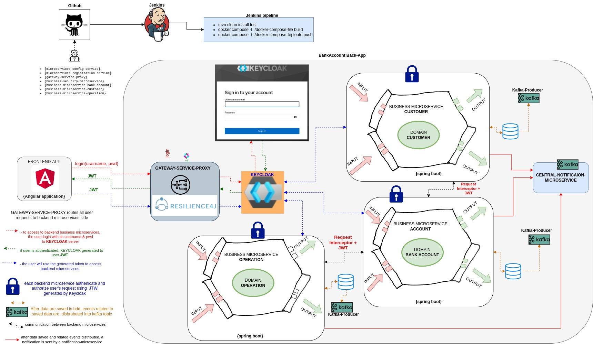
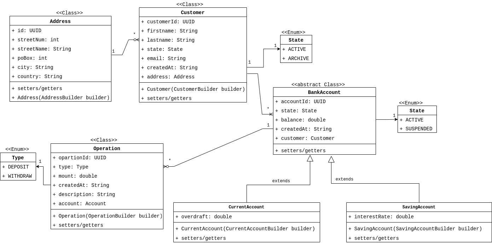

# Résumé
- **Bank-Account-App** est application fullstack (Java 21 /Angular 16) orientée microservices composée des microservices **métiers** et des  microservices **transverses**.
    - la communication entre les microservices se fait de manière **asynchrone** via une **infrastructure Kafka**
- Chaque microservice métier est implémenté dans une **architecture hexagonale**, des tests unitaires sont écrits pour garantir la qualité du code source.
- Une **infrastructure Kafka** est mise en place:
    - pour persister et distribuer les événements liés à la modification des données dans la BDD.
    - our une communication asynchrone entre les microservices
- Un **KeyCloak authentication provider** est mise en place, une implémentation de la sécurité est mise en place dans Chaque backend microservice pour protéger les ressources des backends.
- Une **application frontend** en Angular 16 pour servir de UI utilisateur.
- Une workflow est mise en place avec Jenkins pour automatiser les jobs: ***build***, ***test***, ***docker build***, ***docker push***.

## Bank-Account-App architecture
L'architecture globale de l'application **Bank-Account-App**


## Bank-Account-App conceptual model
Modèle global conceptuel de l'application **Bank-Account-App**


## Authentication & authorization flows to backend resources

- for client, we use ***postman*** and an ***Angular application***
- for authentication & authorization server we use ***KeyCloak***
- backend resources is a ***Bank-Account-App*** base microservices

# Partie Backend
La partie backend de comprend:

 - **4 applications microservices métiers**:
    - ```exalt-hexagonal-archi-kafka-keycloak-bs-ms-customer```
        - managing customers
    - ```exalt-hexagonal-archi-kafka-keycloak-bs-ms-bank-account```
        - managingg bank-accounts
    - ```exalt-hexagonal-archi-kafka-keycloak-bs-ms-operation```,
        - managing operations on bank-accounts
    - ```exalt-hexagonal-archi-kafka-keycloak-bs-ms-notification-service```
        - envoie une notification par mail lorsqu'une operation d'écriture se produit sur un customer, un compte ou une operation 

- **1 api microservice transverse**: 
    - ```exalt-hexagonal-archi-kafka-keycloak-gateway-service-proxy```  
    - la ***exalt-hexagonal-archi-kafka-keycloak-gateway-service-proxy*** route toutes les requêtes authentifiées par ***keycloak*** vers le backend.
        - oauth2 authentication service est implémenté au niveau de la gateway-service proxy pour authentifier toutes les requêtes vers le backend
    - une ***résilience*** est implémentée dans la ***gateway-service-proxy*** lorsque le service backend demandé par l'utilisateur n'est pas disponible.

- chaque microservice métier utilse sa propre base de données MySql pour la persistance les data

- **infrastructure kafka**: pour la persistance et la distribution des événements kafka
    - un zookeeper-server,  
    - 2 kafka-servers,
    - un schema-registry-service
    - un kafka-UI

- Tout l'ecosystème des applications de **Bank-Account-App** sont containeurisées avec **docker** et déployés ensuite dans un cluster locale **Minikuke** avec **Kubernetes**

# Partie Frontend

La partie frontend de **Bank-Account-App **** est une application développée en angular 16**:
- Pattern observable avec **RxJs**
- Gestion observable liés aux événements de click
- Design graphique avec **PrimeNG**
