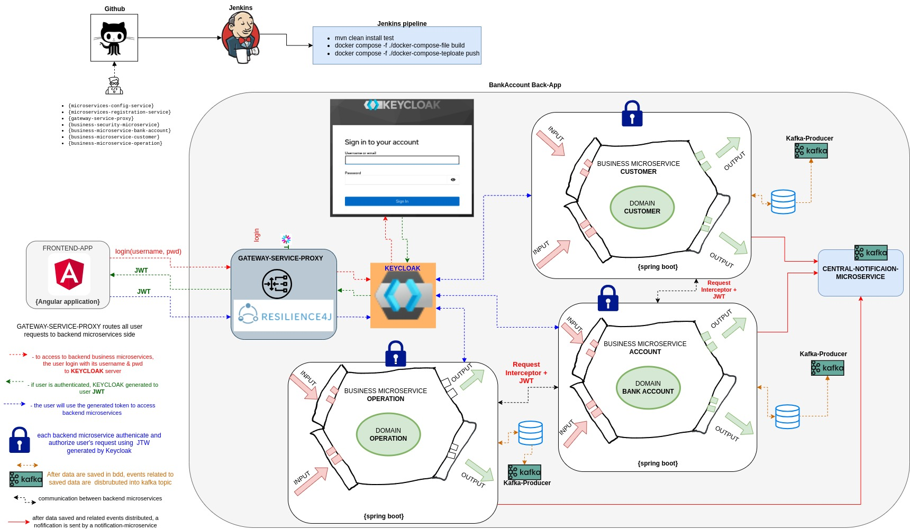

# Résumé
- **Bank-Account-App** est application fullstack (Java 21 /Angular 16) orientée microservices composée des microservices **métiers** et des  microservices **transverses**.
- Chaque microservice métier est implémenté dans une **architecture hexagonale**, des tests unitaires sont écrits pour garantir la qualité du code source.
- Une **infrastructure Kafka** est mise en place pour persister et distribuer les événements liés à la modification des données dans la BDD.
- Un **KeyCloak authentication provider** est mise en place, une implémentation de la sécurité est mise en place dans le **gateway-service-proxy** pour protéger les ressources backend
- Une **application frontend** en Angular 16 pour servir de UI utilisateur
- Une workflow est mise en place avec Jenkins pour automatiser les jobs: ***build***, ***test***, ***docker build***, ***docker push***



# Partie Backend
La partie backend de comprend:

 - **4 applications microservices métiers**:
    - ```exalt-hexagonal-archi-kafka-keycloak-bs-ms-customer```, 
    - ```exalt-hexagonal-archi-kafka-keycloak-bs-ms-bank-account```,
    - ```exalt-hexagonal-archi-kafka-keycloak-bs-ms-operation```,
    - ```exalt-hexagonal-archi-kafka-keycloak-bs-ms-notification-service```

- **1 api microservice transverse**: 
    - ```exalt-hexagonal-archi-kafka-keycloak-gateway-service-proxy``` qui sera remplacé plus tard par un **ingress-controller** de **K8s**

- chaque microservice métier utilse sa propre base de données MySql pur la persistance les data

- **infrastructure kafka**: pour la persistance et la distribution des événements kafka
    - un zookeeper-server,  
    - 2 kafka-servers,
    - un schema-registry-service ,
    - un kafka UI

- Tout l'ecosystème des applications de **Bank-Account-App** sont containeurisées avec **docker** et déployés ensuite dans un cluster locale **Minikuke** avec **Kubernetes**

# Partie Frontend

La partie frontend de **Bank-Account-App **** est une application développée en angular 16**:
- Pattern observable avec **RxJs**
- Gestion observable liés aux événements de click
- Design graphique avec **PrimeNG**
